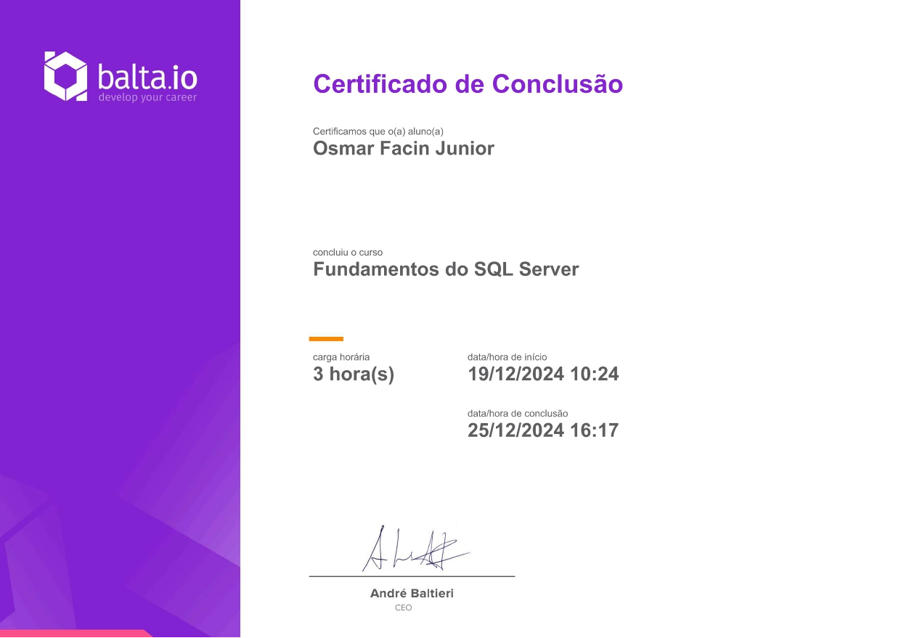

# Fundamentos do SQL Server

Este curso é uma introdução ao SQL Server, cobrindo os fundamentos necessários para trabalhar com bancos de dados relacionais. Ele é ideal para iniciantes que desejam aprender a criar, manipular e consultar dados de maneira eficiente. Ao final do curso, os alunos terão uma base sólida para aplicar SQL em projetos reais.

## Conteúdo do Curso

### Introdução e Fundamentos
- **Ferramentas:** Configuração do SQL Server através do [Docker](https://www.docker.com/) e [Azure Data Studio](https://learn.microsoft.com/en-us/sql/azure-data-studio/).

- **Create Database:** Criação de bancos de dados.
- **Create Table:** Estruturação de tabelas.
- **Alter/Drop Table:** Modificação e exclusão de tabelas.
- **Constraints:**
  - Not Null
  - Unique
- **Chaves:**
  - Primary Key
  - Composite Key
- **Índices:** Otimização de consultas.
- **Identity:** Criação de colunas com valores incrementais automáticos.
- **Operações de Manipulação de Dados:**
  - Insert
  - Select
  - Update
  - Delete

### Consultas e Manipulação Avançada
- **Ordenação e Filtros:**
  - Order By
  - Like
  - In, Between
- **Funções Agregadas:**
  - MIN, MAX, Count
- **Aliases:** Renomeando colunas ou tabelas em consultas.
- **Joins:**
  - Inner Join
  - Left Join
  - Union
- **Agrupamento:**
  - Group By
  - Having
- **Views:** Criação de visualizações de dados.
- **Stored Procedures:** Execução de consultas e lógica no banco de dados.
- **Variáveis:** Uso de variáveis em SQL.

### Mão na Massa
- Exercícios práticos para consolidar os conceitos aprendidos.

## Objetivos
- Compreender os fundamentos de bancos de dados relacionais.
- Aprender a criar e gerenciar tabelas e dados.
- Realizar consultas básicas e avançadas.
- Entender como otimizar consultas com índices e chaves.

## Certificado

